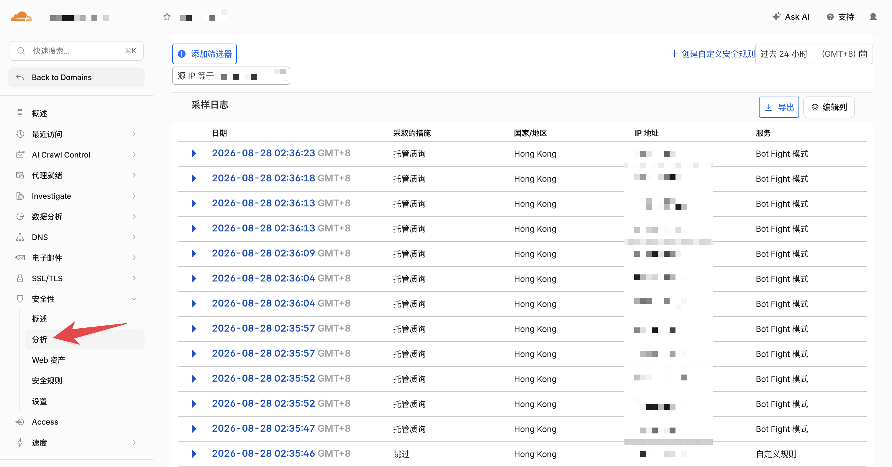
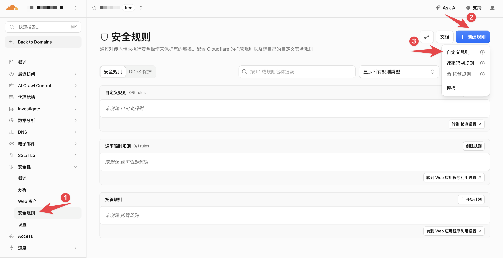
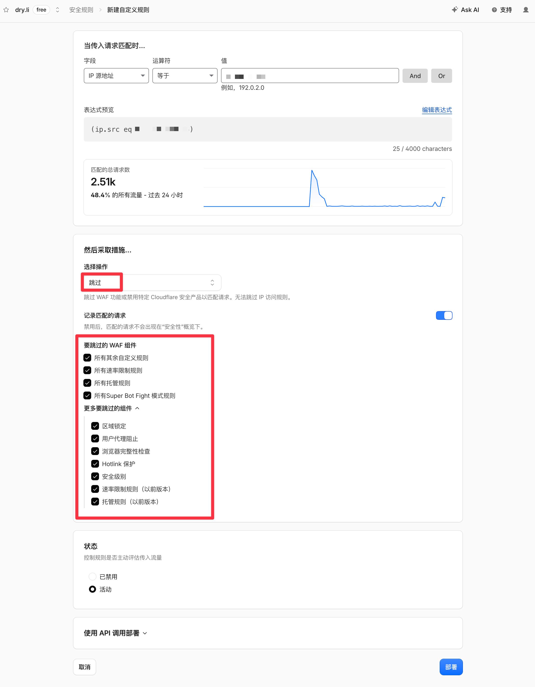
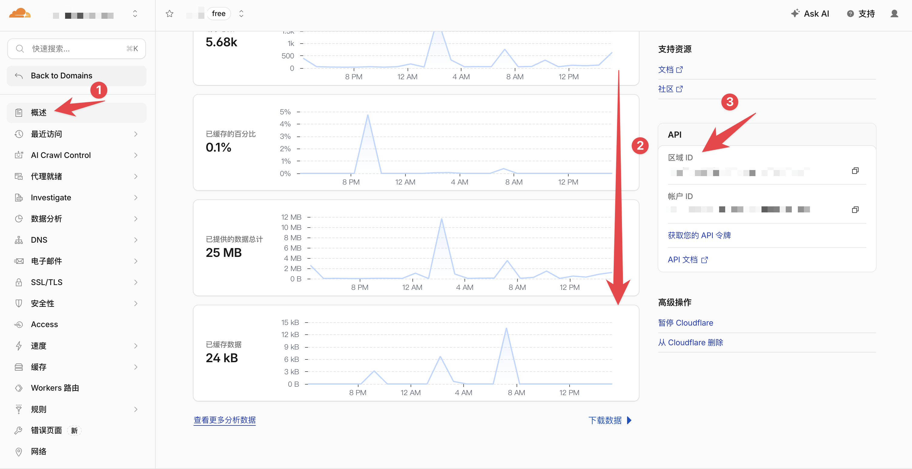
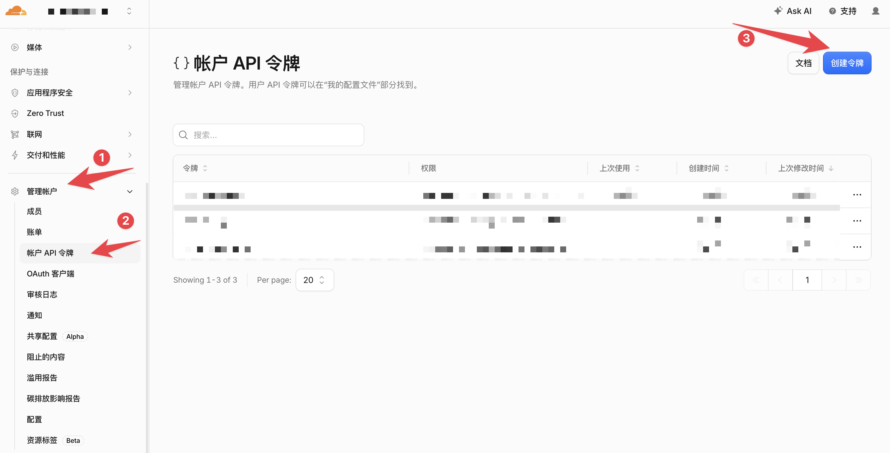
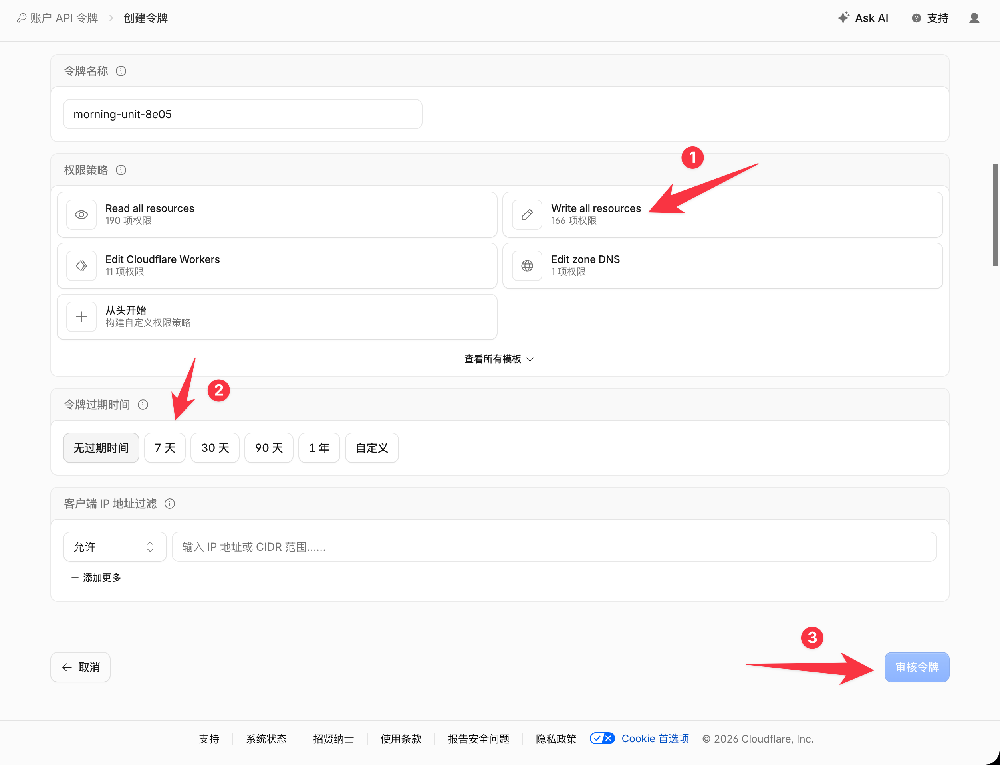
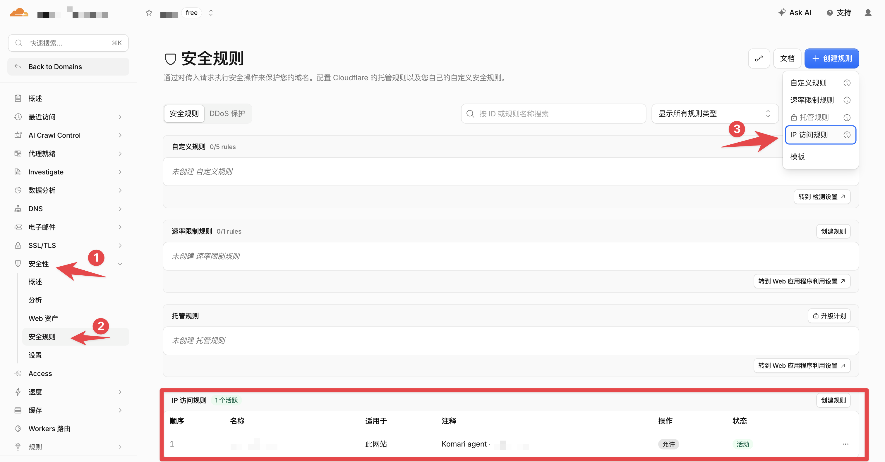

+++
title = "[Tutorial] Allowlisting an IP with Cloudflare Free Bot Fight Mode: A Pitfall Log"
date = "2026-08-28"
draft = false
description = ""
summary = "When a WAF custom rule cannot bypass Free Bot Fight Mode, an IP Access Rule can allowlist a trusted static egress IP."
tags = ["Cloudflare", "Bot Fight Mode", "WAF", "Komari"]
categories = ["Networking"]
series = []

[params]
  showTableOfContents = true
  showReadingTime = true
+++

## What Happened

I recently bought another VPS. After deploying the Komari Agent, however, its node never came online in the monitoring dashboard. The Agent logs showed the following errors:

```text
Failed to connect to WebSocket: 403 Forbidden
...
Error uploading basic info: status code: 403
<!DOCTYPE html><html lang="en-US"><head><title>Just a moment...</title>
```

The cause was fairly obvious: I had put the monitoring service behind Cloudflare, and Cloudflare was blocking the requests at the edge. The Security Events page also contained many blocked requests from the Agent's IP address.



## First Attempt: A WAF Allowlist Rule

I first created a WAF custom rule that matched the Agent's static egress IP:

```text
ip.src eq 203.0.113.10
```

> `203.0.113.10` is only an example. Replace it with the Agent's actual egress IP.

I selected `Skip` as the action. The dashboard offered several components that the request could skip, including:

```text
Managed WAF
Custom Rules
Browser Integrity Check
Security Level
Super Bot Fight Mode
...
```





The intuitive assumption was:

> I skipped security checks for this IP, so surely the Agent should be allowed through now.

It still received a `403`. The logs continued to identify Bot Fight Mode as the component blocking the request.

## First Pitfall: Free Bot Fight Mode Ignores WAF Skip Rules

Cloudflare's [Bot Fight Mode documentation](https://developers.cloudflare.com/bots/get-started/bot-fight-mode/#rules) explains why:

- Standard WAF components run in the Ruleset Engine. A custom rule with the `Skip` action can prevent selected downstream components from running.
- Free Bot Fight Mode does not run in the Ruleset Engine. It uses a separate evaluation pipeline, so the `Skip`, `Bypass`, and `Allow` actions in WAF custom rules do not affect it.
- Super Bot Fight Mode runs in the Ruleset Engine and supports exceptions created with `Skip`, but it requires a paid plan.

That is the confusing part: the Cloudflare dashboard presents a `Skip` button, but Free Bot Fight Mode does not honor that rule.

At first, it seemed that I had only two options:

- Disable Bot Fight Mode.
- Keep the protection enabled and leave the Agent disconnected.

## The Way Out: IP Access Rules

The same documentation mentions an important exception: Bot Fight Mode can still trigger when IP Access Rules are configured, **but it will not trigger when a request matches an IP Access Rule first**.

In other words, a WAF custom rule cannot create an exception for Free Bot Fight Mode, but an IP Access Rule can.

## Second Pitfall: Where Are IP Access Rules?

Cloudflare's documentation described IP Access Rules, but I could not find their entry anywhere in the dashboard. The answer was hidden in the [documentation for creating an IP Access Rule](https://developers.cloudflare.com/waf/tools/ip-access-rules/create/):

> The dashboard only displays the IP Access Rules option after at least one IP Access Rule has already been configured.

For a Zone that has never had such a rule, the current dashboard does not expose the entry directly. This creates a strange loop: **to create the first rule in the dashboard, a rule must already exist.**

## Solution: Create the First IP Access Rule with the API

Cloudflare exposes almost every configuration capability through its API. The dashboard is effectively a management layer built on top of that API, so when the UI hides an entry, calling the API directly is often the simplest solution.

Cloudflare still provides an API for [creating IP Access Rules](https://developers.cloudflare.com/api/resources/firewall/subresources/access_rules/methods/create/). Here is the full process.

### 1. Get the Zone ID

Open `Cloudflare Dashboard → Domain → Overview`, then copy the `Zone ID` from the API section on the right side of the page.



### 2. Create an API Token

Go to `Cloudflare Dashboard → Manage account → Account API tokens → Create Token`.





> [!WARNING] Permissions and token security
> The screenshot uses `Write all resources` for a quick test, but that permission is far broader than necessary and should not be kept. A safer approach is to create a custom token with only the `Account Firewall Access Rules Write` permission required by the API documentation and restrict its resource scope to the target account. Cloudflare displays the complete token only once. Store it securely, and delete or revoke this temporary token as soon as the rule has been created.

### 3. Create the Allowlist Rule Through the API

Set the required environment variables on your own computer or VPS:

```bash
export CF_ZONE_ID='your Zone ID'
export CF_API_TOKEN='your API Token'
```

Then create a rule for the IP you want to allowlist:

```bash
curl -sS -X POST \
  "https://api.cloudflare.com/client/v4/zones/${CF_ZONE_ID}/firewall/access_rules/rules" \
  -H "Authorization: Bearer ${CF_API_TOKEN}" \
  -H "Content-Type: application/json" \
  --data '{
    "mode": "whitelist",
    "configuration": {
      "target": "ip",
      "value": "IP address to allowlist"
    },
    "notes": "Komari agent - alibabahk"
  }'
```

The following field:

```json
"mode": "whitelist"
```

corresponds to the `Allow` action in IP Access Rules. Cloudflare's API schema explicitly supports `whitelist` as a mode.

A successful request should return a response similar to this:

```json
{
  "result": {
    "id": "xxxxxxxxxxxxxxxx",
    "mode": "whitelist",
    "configuration": {
      "target": "ip",
      "value": "your IP"
    }
  },
  "success": true,
  "errors": [],
  "messages": []
}
```

Return to the Cloudflare dashboard and the `IP access rules` entry will now be visible, making future allowlist management much easier.



At the same time, the Komari Agent on the VPS should be able to connect normally, and the node should come online.

## Summary

This solution works well for a trusted service with a static egress IP that needs to bypass Free Bot Fight Mode.

**Advantages:**

- Bot Fight Mode can remain enabled for the Zone.
- Other source IPs are still protected by Bot Fight Mode.
- It is free.

**Disadvantages:**

- The `Allow` action in an IP Access Rule excludes matching visitors from security checks such as the WAF, Browser Integrity Check, and Under Attack Mode. Its scope is much broader than merely bypassing Bot Fight Mode.
- It cannot match a specific Host or Path, so it is only suitable when the entire egress IP can be trusted.
- The rule must be updated whenever the IP changes, making it unsuitable for Agents with dynamic egress IPs.

The underlying issue was simple: add the blocked static IP to an IP Access Rule. What made the investigation confusing was that Cloudflare places security mechanisms from different generations and evaluation pipelines in the same dashboard. They look similar, but they do not share the same bypass behavior.
