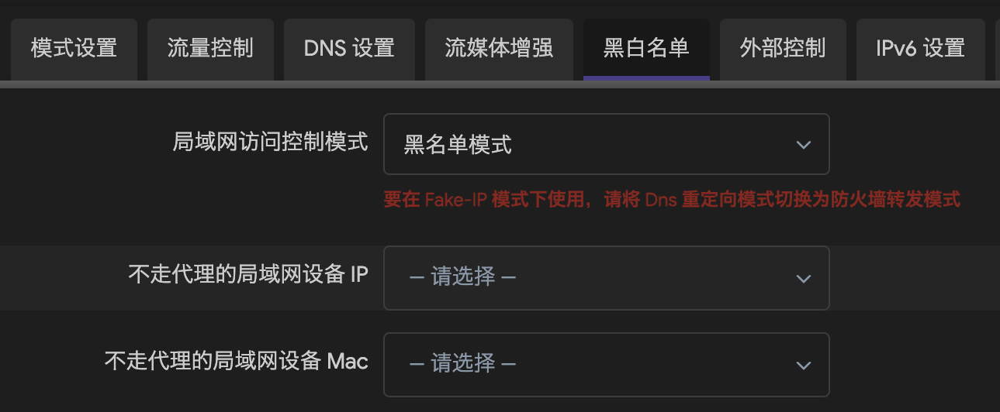
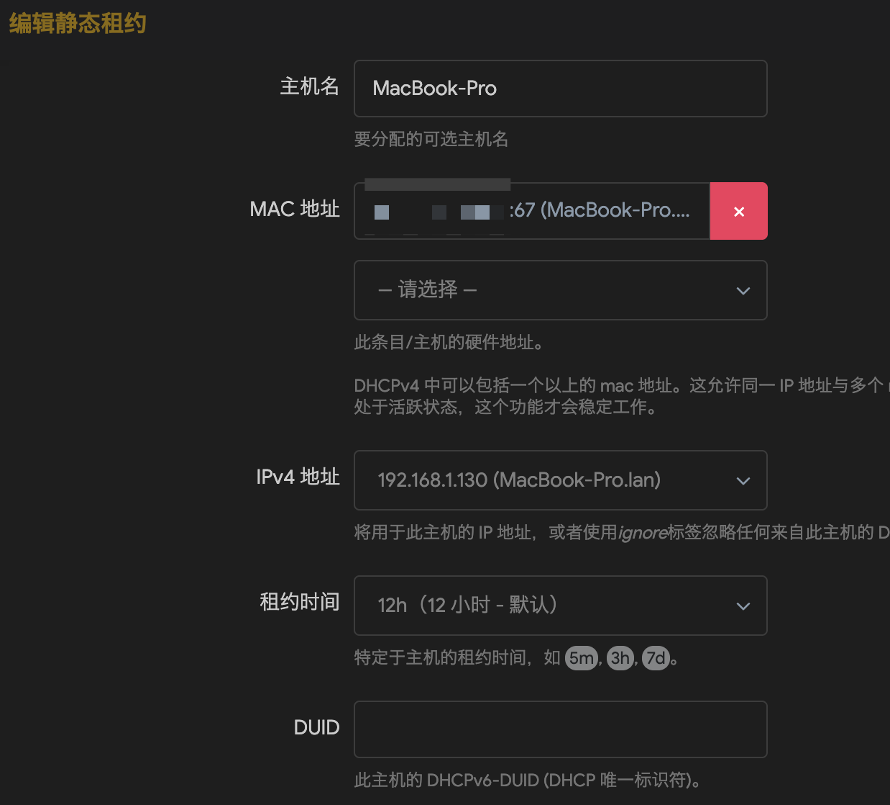
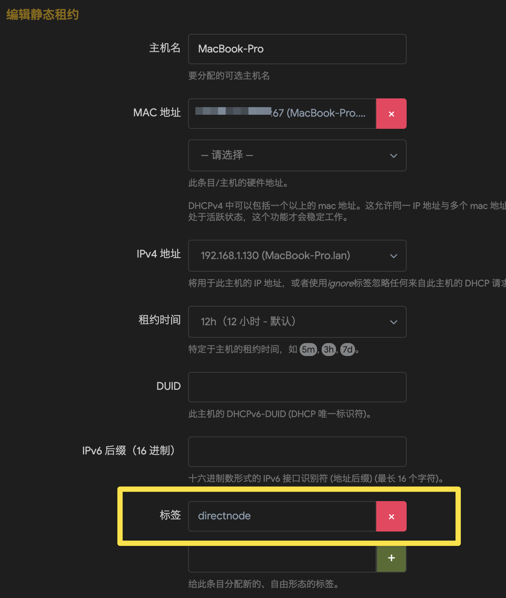
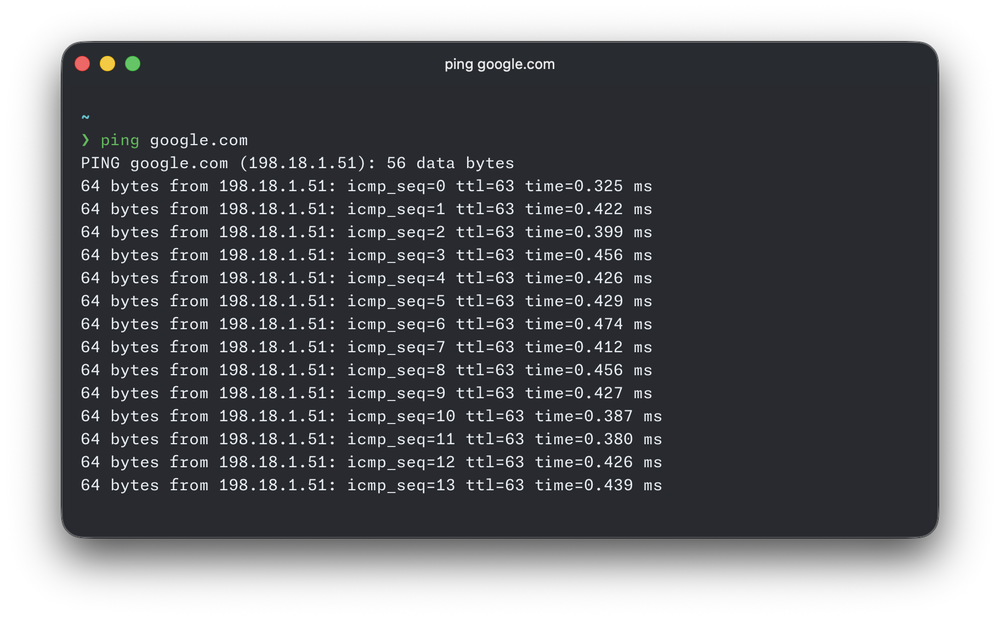

+++
title = "[Tutorial] Let OpenClash in fake-ip Dnsmasq Forwarding Mode Bypass the Kernel by Device MAC"
date = "2026-03-07"
draft = false
description = ""
summary = "Implemented per-device proxy routing in OpenClash under fake-ip with Dnsmasq forwarding."
tags = ["OpenClash", "Soft Router"]
categories = ["Networking"]
series = []

[params]
  showTableOfContents = true
  showReadingTime = true
+++

# Background

I recently bought a new soft router and configured OpenClash as a whole-home proxy. However, the network environment I use when developing on my Mac changes frequently, and I also use Surge for rewrite rules. After all, if my entire home network already uses OpenClash, then did I buy Surge for nothing? 😭 In the end, my goal was still to let Surge take over proxy handling on my computer.

Then came the problem. The mode currently promoted by OpenClash is fake-ip mode. But in fake-ip mode, if you want to implement LAN device allowlist/blocklist filtering, the DNS hijacking mode must be changed to **Firewall Forwarding**, and **Dnsmasq Forwarding is not supported**.



Giving up Dnsmasq forwarding means giving up OpenClash's "bypass mainland China" feature. This feature allows traffic to popular domestic Chinese websites to avoid being processed by the Clash core, effectively reducing the load on the core while improving access speed.

In Dnsmasq mode, the most common way to control whether a device uses the proxy is to add this rule to OpenClash's rule set:

```yaml
rules:
	SRC-IP-CIDR,192.168.1.23/32,DIRECT
```

This does make a specific device avoid the proxy, but the downside is also obvious. Although the specific device does not use the proxy, its traffic still enters the kernel, gets unpacked, and is then wrapped and forwarded according to rules. This still increases kernel load.

> [!info] Another drawback of fake-ip
> In fake-ip mode, pinging domain names from devices stops working. This is because after fake-ip mode is enabled, OpenClash adds firewall rules to reject ICMP packets in order to keep the system operating correctly, which causes ping to fail.

Therefore, whether using Dnsmasq forwarding or firewall forwarding, neither can solve all of the problems above. So, is it possible to make all traffic from a specific device completely bypass the kernel, so that OpenClash is entirely transparent to that device when it goes online?

**This way, whether it is a NAS or some other device, you can safely let it connect directly without worrying that its traffic will secretly be used up.**

---

# References

While implementing the goal above, I referred to the following links:

[openclash的基础设置，实现全屋代理](https://github.com/Aethersailor/Custom_OpenClash_Rules/wiki/OpenClash-%E8%AE%BE%E7%BD%AE%E6%96%B9%E6%A1%88)

[# OpenWrt 使用 Tag 给特定的设备单独指定旁路网关的地址和 DNS](https://blog.hellowood.dev/posts/openwrt-%E4%BD%BF%E7%94%A8-tag-%E7%BB%99%E7%89%B9%E5%AE%9A%E7%9A%84%E8%AE%BE%E5%A4%87%E5%8D%95%E7%8B%AC%E6%8C%87%E5%AE%9A%E6%97%81%E8%B7%AF%E7%BD%91%E5%85%B3%E7%9A%84%E5%9C%B0%E5%9D%80%E5%92%8C-dns/)

[OpenClash 在 Dnsmasq 转发模式下基于 MAC 绕过设备](https://kasuha.com/posts/openclash-dns-forward-bypass-by-mac/)

# Integrated Implementation

I combined and optimized the content from the documents above into the implementation tutorial below.

Here is the system information of my soft router when this tutorial was written:

- Firmware version: ImmortalWrt 24.10.4 r33602-e717d133ed6d / LuCI openwrt-24.10 branch 25.300.72106~0418b54
- Kernel version: 6.6.110
- Clash core version: **alpha-g86257fc**
- OpenClash client version: **v0.47.055**

**If you find that some Web UI elements do not match during implementation, search for the equivalent operation method for your own system version.**

## Assign a Fixed IP Address to the Device

If you have already configured a DHCP static IP address for the device, skip this step.

Go to `Network` -> `DHCP/DNS` -> `Static Leases` -> `Add`.

For `MAC address`, select the device's MAC address. For `IPv4 address`, enter the device's current IP address. Set `Lease time` to 12h, keep the rest as default, then save and apply the configuration. From now on, every time the device connects to the network, it will receive this same IP address.



## Modify Source Traffic Access Control

Go to the OpenClash homepage, select `Plugin Settings`, scroll to the bottom, and in the Source Traffic Access Control settings area, add a new entry. Set `Internal Address` to the fixed IP address from earlier, leave `Port` empty, set `Protocol` to `All`, and set `Target` to `RETURN`. After finishing, click `Apply Configuration` at the bottom.

After this setup, traffic from the device to real-ip addresses will bypass the kernel directly. However, the device needs DNS first in order to obtain real-ip addresses. If the device's DNS server address is still set to the router gateway address, the kernel will still hijack DNS requests and return fake-ip addresses. Source Traffic Access Control will not make traffic to fake-ip addresses bypass the kernel. Therefore, in the next step, we need to set the device's DNS server.

## Set the Device's DNS Server

There are two ways to set the device's DNS server:

### Method 1

- Go directly into your device's network settings and manually change the DNS server to popular domestic Chinese DNS servers, such as `114.114.114.114`, `223.5.5.5`, or `119.29.29.29`.

Personally, I recommend the second method more. Method 2 does not modify the device's network settings, making it easier to keep the device's network settings consistent when switching between different network environments.

### Method 2

This method is based on Dnsmasq's tag feature. It can assign gateway and DNS server addresses to a specific device. Here, we only need to assign DNS server addresses.

Go back to the page where you fixed the IP address. Edit the static lease entry you just configured, find `Tag`, and add one, such as `directnode`. The tag name must not contain spaces or special characters. Save and apply.



Enter the OpenWrt command-line page and run the following commands:

```bash
uci set dhcp.directnode="tag"
uci set dhcp.directnode.dhcp_option="6,223.5.5.5,119.29.29.29,114.114.114.114"
uci commit dhcp
/etc/init.d/dnsmasq restart
```

In the commands above, `directnode` is the tag name you created. Its type is set to `tag`. In `dhcp_option`, `6` represents the DNS server addresses to be distributed. Multiple addresses are separated directly with commas.

Disconnect the device from the network and reconnect it. This will trigger DHCP assignment again. Check the device's network settings. The DNS server addresses distributed by the router should no longer be the router's address.

In theory, the DNS process should no longer go through the router at this point. Now the entire path, from DNS to accessing real-ip addresses, should bypass the kernel. However, if you try accessing Google at this point, you will find that your device can still access it successfully.

## Modify Firewall Rules

The issue is actually caused by the router's firewall rules. After OpenClash starts in fake-ip mode, it adds a firewall rule that hijacks all TCP/UDP requests to port 53 and redirects them to the local port 53. This means the public DNS servers configured above do not actually take effect. Requests sent by the device to public DNS servers are still hijacked and return fake-ip addresses.

The solution is also simple. OpenClash's allowlist/blocklist implementation in firewall forwarding mode depends on the firewall. It maintains a set of MAC addresses for devices that need to bypass the proxy. Then, during DNS hijacking, any packet whose MAC address matches this set is passed through directly.

We can follow this idea and implement allowlist/blocklist behavior in Dnsmasq mode as well. In OpenClash, users can operate firewall rules through an overwrite script.

Go to the OpenClash homepage, click `Plugin Settings`, then click `Developer Options`.

Paste the overwrite code below and fill in the specific device MAC addresses. This code maintains a set of MAC addresses that should bypass Clash, so packets matching the set are passed through directly during DNS hijacking.

> [!warning]
> The code below modifies a firewall based on `nftables`. If you are using an `iptables` firewall, some syntax may not apply. You can ask AI to help convert the syntax.

```bash
#!/bin/sh
. /usr/share/openclash/ruby.sh
. /usr/share/openclash/log.sh
. /lib/functions.sh

# This script is called by /etc/init.d/openclash
# Add your custom overwrite scripts here, they will be take effict after the OpenClash own srcipts

LOG_OUT "Tip: Start Running Custom Overwrite Scripts..."
LOGTIME=$(echo $(date "+%Y-%m-%d %H:%M:%S"))
LOG_FILE="/tmp/openclash.log"
#Config Path
CONFIG_FILE="$1"
    sleep 20
    LOG_OUT "Tip: Start Add Custom Firewall Rules..."
    # >>> Fill in the MAC addresses of devices that need to bypass Clash here, separated by spaces
    MACS="aa:bb:cc:dd:ee:ff"

    # 1) Set: lan_bypass_macs. Flush it if it exists to ensure repeatable execution.
    if nft list set inet fw4 lan_bypass_macs >/dev/null 2>&1; then
      nft flush set inet fw4 lan_bypass_macs || :
    else
      nft add set inet fw4 lan_bypass_macs '{ type ether_addr; flags interval; }' || :
    fi

    # Populate the set
    for mac in $MACS; do
      # Normalize to lowercase
      m=$(echo "$mac" | tr 'A-F' 'a-f')
      nft add element inet fw4 lan_bypass_macs "{ $m }" 2>/dev/null || :
    done

    # 2) Delete all old "ether saddr @lan_bypass_macs return" rules, then insert one at the top of the chain
    nft -a list chain inet fw4 dstnat 2>/dev/null | awk '
      /ether saddr @lan_bypass_macs/ && / return/ {
        for (i=1;i<=NF;i++) if ($i=="handle") {print $(i+1)}
      }' | while read -r h; do
        [ -n "$h" ] && nft delete rule inet fw4 dstnat handle "$h" 2>/dev/null || :
      done
    nft insert rule inet fw4 dstnat ether saddr @lan_bypass_macs return || :
    LOG_OUT "Done: MAC bypass rules loaded."
exit 0
```

At this point, all traffic from your device should no longer enter the Clash core, and fake-ip should no longer affect pinging domain names either 😄.


