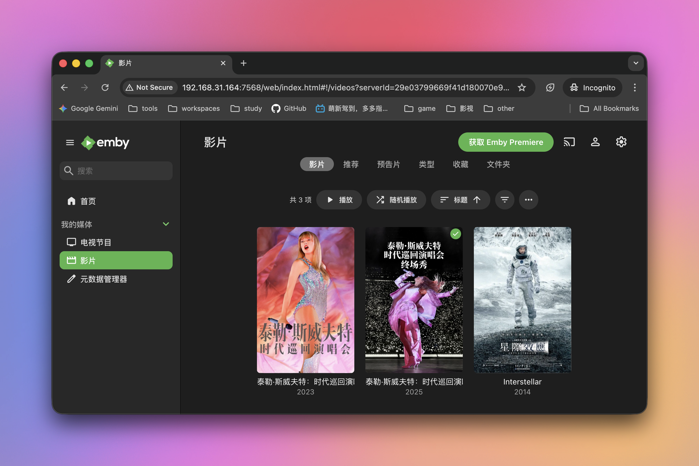
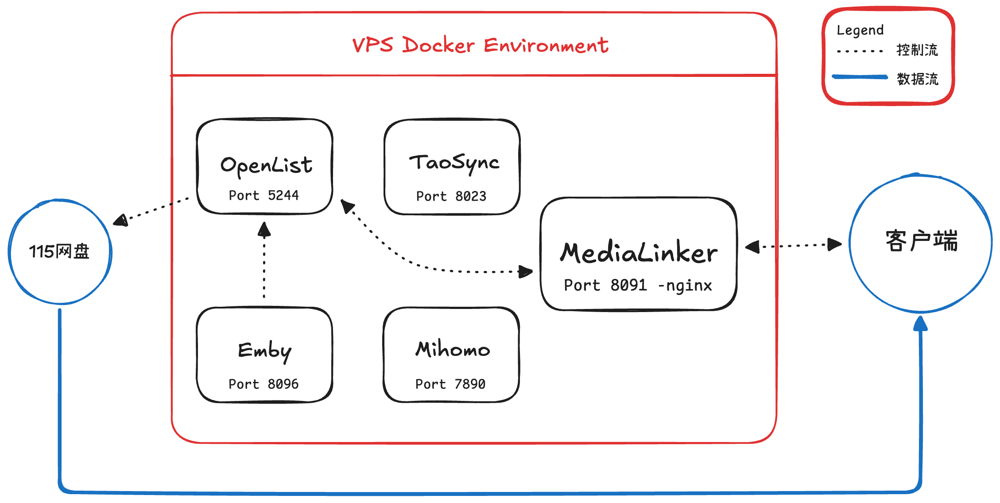
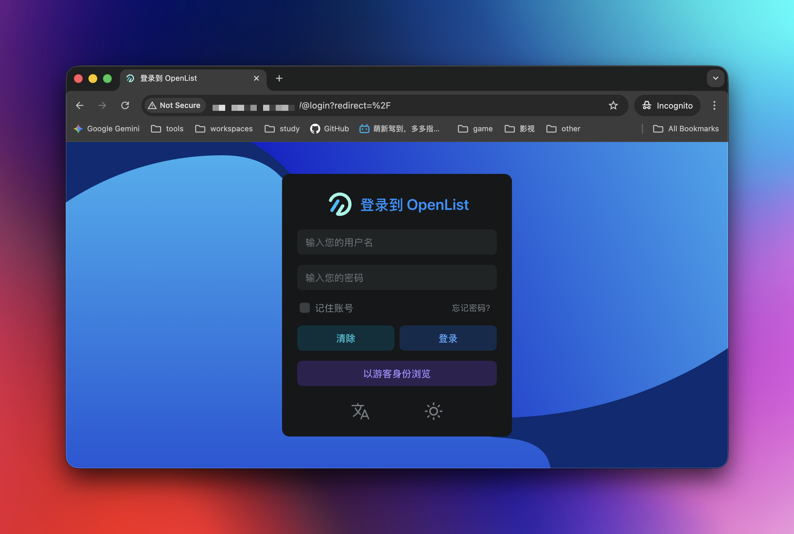
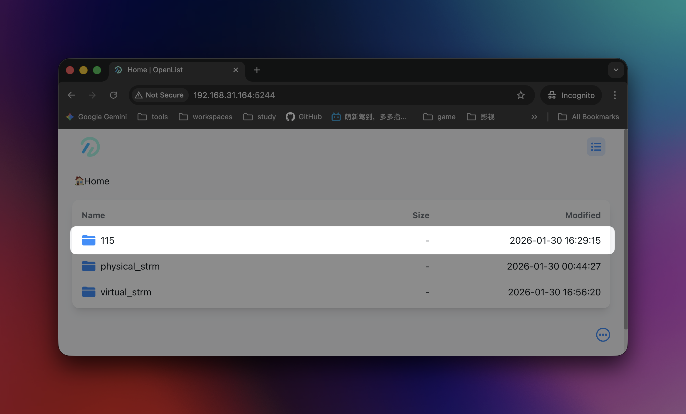
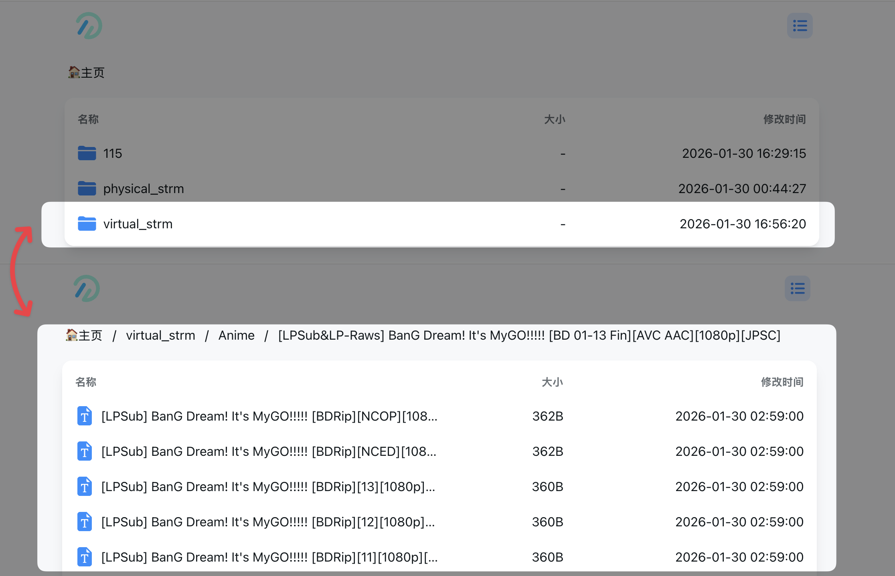
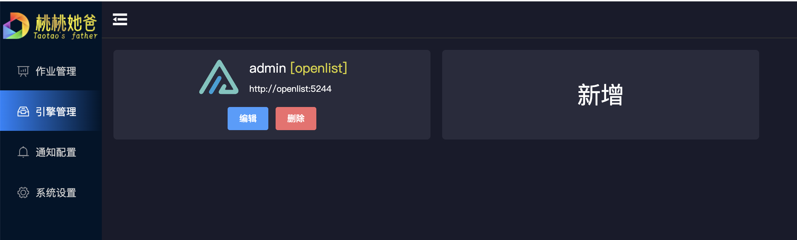
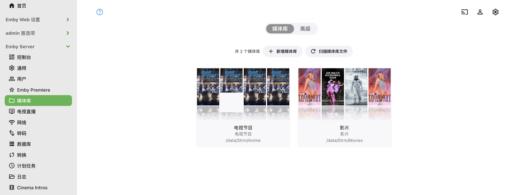
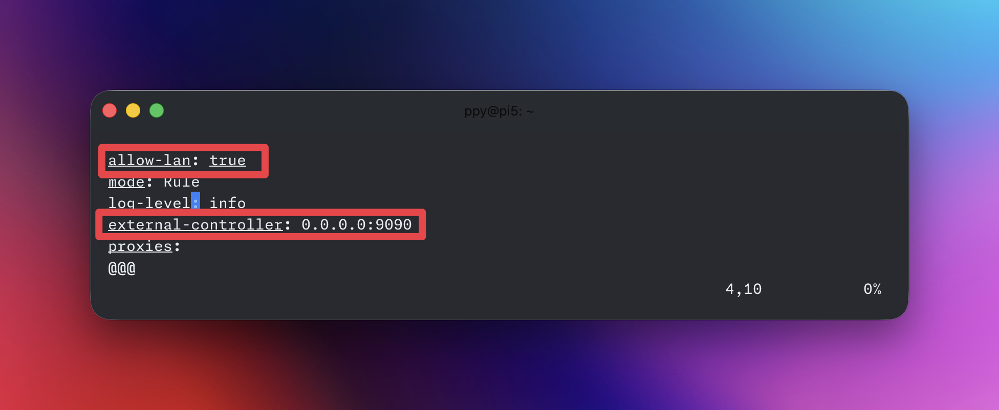
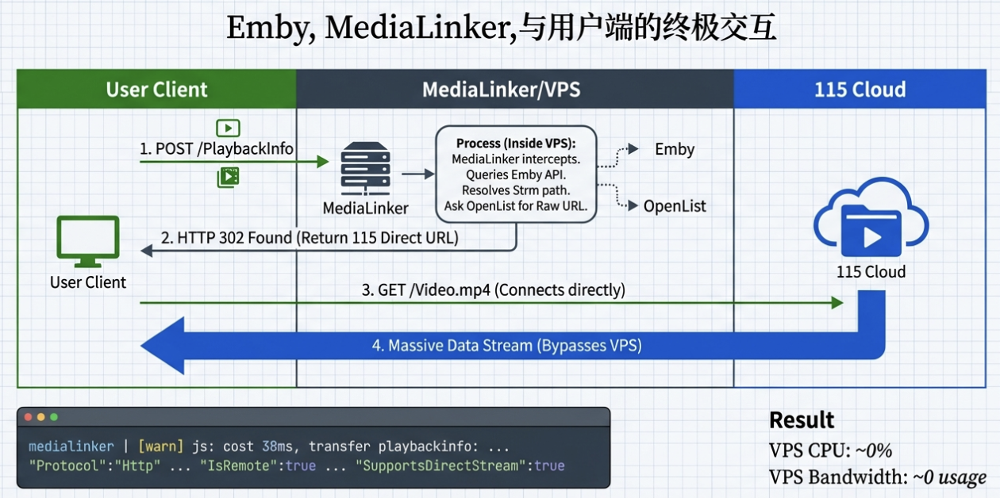

+++
title = "[Tutorial] Because I Could Not Afford More Storage, I Built a Home Media Library with a Raspberry Pi, 115 Cloud Drive, and Strm Files: A Pitfall Log"
date = "2026-01-30"
draft = false
description = ""
summary = "After quite a bit of tinkering, I managed to deploy an Emby setup on a lightweight server that can play 4K Blu-ray remux movies."
tags = ["Emby", "Docker", "115 Cloud Drive", "Raspberry Pi", "OpenList"]
categories = ["Projects"]
series = []

[params]
  showTableOfContents = true
  showReadingTime = true
+++

# Background

Recently, I wanted to tinker with a NAS for building a home media library. After looking into it carefully, however, I found that both memory and hard drives were not priced very attractively. In recent years, as NAS devices have become more mainstream, ISPs have also tightened their restrictions on upload bandwidth, which gradually hurts remote playback performance.

It just so happened that this excellent article solved my needs quite well: [【教程】如何用一台2g15g的VPS结合网盘实现302直链播放的个人全自动追番Emby影视库](https://idcflare.com/t/topic/31258?u=witcheng)

So I reproduced the setup by following the author's approach, and I recorded the pitfalls I encountered along the way at the end. If you run into problems during deployment, I hope the holes I fell into can save you from falling into them again. I hope this helps!

### Preparation

Knowledge you should have:

1. Basic Linux operations.
2. Basic Docker usage.

My setup:

2. Raspberry Pi 5, 8 GB RAM, 32 GB storage card.
3. 115 Cloud Drive membership.

> [!INFO] About the device
> Based on my experience after successfully deploying this setup, the performance of my Raspberry Pi 5 is **completely overkill**. Due to the characteristics of this viewing architecture, the device's CPU usage stays at 0 most of the time, so an entry-level VPS is entirely sufficient.

> [!INFO] About cloud drives
> The choice of cloud drive mainly comes down to two things:
>
> 1. Preferably use a domestic Chinese cloud drive. This architecture fully supports playback of **Dolby Blu-ray remux movies**. A movie like that is usually around 70-80 GB. If you use an overseas cloud drive, the traffic costs can be very high, and most overseas cloud drives do not provide CDN acceleration in mainland China.
> 2. Preferably use one without speed limits. Playing high-bitrate videos places heavy demands on the cloud drive's bandwidth. If your cloud drive membership is throttled, such as Quark Cloud Drive redeemed through Taobao 88 VIP, the viewing experience will be much worse.

### Final Result

If the setup succeeds, you can build a home media library with:

1. Instant playback of 4K remux movies.
2. Zero server bandwidth consumption, with bandwidth provided by the cloud drive provider.

Final result:



---

# Solution Overview

### Component Overview

This solution is deployed entirely with Docker containers, so it is quite portable. Understanding what each Docker container does will help us understand the full architecture.

##### OpenList

[OpenListTeam/OpenList](https://github.com/OpenListTeam/OpenList)

This is equivalent to self-hosting a **cloud drive branded as OpenList** on your server. You can mount other cloud drives on the market under directories in this OpenList drive. Understanding this is **crucial** for understanding the rest of the architecture.

> [!NOTE]
> For example, I mounted 115 Cloud Drive under OpenList's `/115` directory, and I mounted Quark Cloud Drive under OpenList's `/Quark` directory. Users only need to access the OpenList drive to access two or even more cloud drives at the same time.

##### TaoSync

[dr34m-cn/taosync](https://github.com/dr34m-cn/taosync)

TaoSync can download *online* content from OpenList to the server. In this setup, it is mainly used to sync the Strm files generated by OpenList to the server.

##### Mihomo

[MetaCubeX/mihomo](https://github.com/MetaCubeX/mihomo)

Mihomo is a proxy component based on Clash.Meta. It allows the server to access websites outside the Great Firewall, mainly to solve the problem where Emby fails to fetch movie metadata.

##### Metacubexd

[MetaCubeX/metacubexd](https://github.com/MetaCubeX/metacubexd)

Metacubexd is the frontend dashboard for Mihomo, used to control Mihomo's proxy nodes.

##### Emby

Emby is the **core** of the home media library. It centrally manages resources in the media library. In this solution, it is mainly used to scan locally stored Strm files and build the media library index.

Docker image: [https://hub.docker.com/r/amilys/embyserver](https://hub.docker.com/r/amilys/embyserver)

##### MediaLinker

[thsrite/MediaLinker](https://github.com/thsrite/MediaLinker)

MediaLinker reverse proxies Emby and intercepts user playback requests, redirecting them to the cloud drive. It is **the key to achieving zero server load during playback**.

### How the Solution Works

The core idea of this solution is to **turn a lightweight VPS into a gateway for a petabyte-scale data center**. All data exchanged between the user and the VPS consists of control signals. The VPS directly redirects the user's playback request to the cloud drive, and the video traffic **bypasses** the VPS and goes straight to the user's device. This greatly lowers the server hardware requirements.



# Deployment

After preparing the VPS, create a directory named `my_media` under the user's home directory. All configuration for the home media library will be stored in this directory.

### Deploy OpenList

Create a `docker-compose.yml` file under `my_media`, and fill in the configuration for our first container, OpenList.

##### docker-compose.yml

```yml
services:
  # OpenList configuration
  openlist:
    image: openlistteam/openlist:latest # Official image
    container_name: openlist
    restart: always # Automatically restart the service if the server unexpectedly loses power
    ports:
      - 5244:5244 # Map port 5244 to the outside
    environment:
      - TZ=Asia/Shanghai # China timezone
    volumes:
      - ./openlist/data:/opt/openlist/data # Store all OpenList configuration under my_media/openlist
      - ./Strm:/Strm # Important! Save Strm files generated by OpenList to my_media/Strm on the host machine
```

##### Mount the Cloud Drive

After editing the file, try starting the service. Enter this in the command line:

```bash
docker compose up -d
```

After it starts successfully, visit `http://<server-ip>:5244`. You should be able to enter the OpenList main page.



The account is `admin`. The password will be printed in the terminal logs the first time OpenList starts. After logging in, change the password immediately.

Follow OpenList's [official documentation](https://doc.oplist.org/guide/drivers/common) to add the cloud drive you use. I added 115 Cloud Drive. After adding it successfully, it will appear on the homepage.



##### Generate Strm Files

A `.strm` file is essentially a **plain text file**. It does not store any video content. Instead, it only stores one or more lines containing **direct access URLs for media resources**, such as HTTP, HTTPS, WebDAV, SMB, or RTSP URLs.

You can think of it as a "**video shortcut**" or an "**online playback pointer**".

Emby supports reading Strm files perfectly. In Emby's eyes, a `.strm` file is a media video. Therefore, we can store a large number of Strm files on a lightweight VPS with limited storage space.

OpenList supports scanning an internal target and automatically generating corresponding `.strm` files for files under that directory. Go to OpenList Management -> Storage -> Add -> select `Strm` as the driver name. We need to fill in the following:

1. Mount path: `/virtual_strm`
2. Enable signature: enabled.
3. Path: the path of the cloud drive you mounted in OpenList. For example, I mounted 115 Cloud Drive under `/115`, and my media files are stored in `01_Media_Library` on the cloud drive, so my full path is `/115/01_Media_Library`.
4. Site URL: fill in `http://<server-ip>:5244`. This way, the generated **direct media access URLs** are external addresses, not container-internal addresses.
5. Carry signature: enabled. After enabling this, the direct links generated by OpenList will include signatures for authentication. **If your server is exposed to the public internet, make sure to enable this**. It prevents someone from guessing your cloud drive directory structure and using direct links arbitrarily.

After this is complete, OpenList will automatically generate `.strm` files for the directory you selected under `/virtual_strm`.



As expected, if we visit the link inside a `.strm` file in the browser at this point, it should play directly, and the server should not show any obvious traffic changes.

> [!Warning] Note
> At this stage, the `.strm` files are only stored inside the OpenList drive. From the VPS's perspective, these files are still online files, while `Emby` only supports accessing local folders. Therefore, we need to sync the `.strm` files to a local folder. We use TaoSync to do this.

---

### Deploy TaoSync

Add TaoSync's configuration to the `docker-compose.yml` we just edited.

##### docker-compose.yml

```yml
services:
  # OpenList configuration
  openlist:
  ...

  # TaoSync configuration
  taosync:
    image: dr34m/tao-sync:latest # Official image
    container_name: taosync
    restart: always
    ports:
      - 8023:8023 # Map port 8023 to the outside
    volumes:
      - ./taosync:/app/data # Store TaoSync configuration under my_media/taosync
```

##### Configure the Sync Job

Start the service again. Now visit `http://<server-ip>:8023`, and you should enter the TaoSync main page. Similar to OpenList, the username is `admin`, and the password is printed in the logs. If it is not there, use the recovery key in `my_media/taosync` to change the password.

TaoSync is essentially used to operate cloud drives and does not support operations on local files. However, we can mount another path of type **Local Storage** in OpenList. Again, go to OpenList Management -> Storage -> Add -> select `Local Storage` as the driver name. We need to fill in:

1. Mount path: `/physical_strm`
2. Enable signature: enabled.
3. Root folder path: `/Strm`.

After saving, we should now see the `physical_strm` directory in OpenList, and it should be empty.

Enter TaoSync, go to Engine Management -> Add Engine, and fill in:

1. Address: the OpenList entry address, namely `http://<server-ip>:5244`.
2. Remark: fill in anything you like.
3. Token: in OpenList, go to Management -> Settings -> Other -> the token at the very bottom of the page. Copy it and paste it here.



Next, go to Job Management -> Create Job, and fill in:

1. Engine: the engine you just created.
2. Source directory: the directory storing the generated `strm` files, namely `/virtual_strm`.
3. Target directory: the directory to sync to, namely the local storage directory `/physicial_strm` that we just created.
4. Sync method: full sync. This way, files deleted in the cloud will also be deleted locally.
5. Sync interval: 10 minutes. Adjust this based on your own needs; this time is only for reference.

After finishing, click manual execution on the right side of the job to perform the initial sync. After it finishes, enter OpenList's `/physical_strm` directory. It should now contain the `strm` files generated earlier.

> [!NOTE]- Distinguishing the various strm folders (click to expand)
> This was one of the things that confused me a lot when I first started building the setup. From the beginning of deployment until now, three `strm` folders have appeared: `/Strm`, `/virtual_strm`, and `/physical_strm`.
>
> To make their scopes easier to distinguish, I use a network-protocol-like prefix for these folders:
>
> 1. `VPS://` means this directory is physically stored on the server, no different from any other folder on the server.
> 2. `OpenList://` means this directory is only visible inside OpenList. It is similar to content in other cloud drives. Changes you make there will not affect local files on the server, just like creating a folder in a cloud drive has no effect on your computer.
>
> Now let's talk about what happens when these `strm` directories work together.
>
> 1. After we add `OpenList://virtual_strm`, OpenList automatically generates the same directory structure as `OpenList://115/01_Media_Library` under this directory, and creates a `strm` file for each media file. This is the initial set of `strm` files.
> 2. After we configure `OpenList://physical_strm`, because of how OpenList's local storage directory works, OpenList mounts the `VPS://my_media/Strm` folder onto `OpenList://physical_strm`. When we operate on `OpenList://physical_strm`, we are actually operating on `VPS://my_media/Strm`.
> 3. When we use TaoSync to sync `OpenList://virtual_strm` with `OpenList://physical_strm`, TaoSync keeps `OpenList://physical_strm` consistent with `OpenList://virtual_strm`. And when `OpenList://physical_strm` is operated on, `strm` files are also written into `VPS://my_media/Strm`.

At this point, we have successfully created `strm` files for the content on the cloud drive and stored them locally.

Now, if you upload another video to the cloud drive, its `strm` file will appear in the server-side `my_media/Strm` directory 10 minutes later. Clicking the link in the `strm` file in a browser should also play directly.

---

### Deploy Emby

Emby is **personal media server** software. Once deployed on the server, it can organize media resources scattered across local hard drives, a NAS, or remote storage into a unified **media library with posters, descriptions, and actor information**, and provide online playback through clients.

Continue writing the Emby configuration in `docker-compose.yml`.

##### docker-compose.yml

```yml
servicces:
	# OpenList configuration
	openlist:
	...
	
	# TaoSync configuration
	taosync:
    ...
	
	# Emby configuration
	embyserver:
	    image: amilys/embyserver_arm64v8:latest # Image for ARM architecture
	    container_name: emby
	    network_mode: bridge # Use bridge mode
	    environment:
	      - UID=0
	      - GID=0
	      - TZ=Asia/Shanghai
	      - HTTP_PROXY=http://192.168.31.164:7890
	      - HTTPS_PROXY=http://192.168.31.164:7890
	      - http_proxy=http://192.168.31.164:7890
	      - https_proxy=http://192.168.31.164:7890
	      - NO_PROXY=localhost,127.0.0.1,openlist,medialinker
	      - no_proxy=localhost,127.0.0.1,openlist,medialinker
	    volumes:
	      - ./emby/config:/config
	      - ./Strm:/data/Strm # Map the local VPS://Strm target into the container
	    ports:
	      - 7568:8096 # Map Emby port to 7568
	    restart: always
```

> [!Warning] Pay attention to your server architecture
> Since my Raspberry Pi uses the ARM architecture, my Emby image is also the ARM image. Please choose the correct image based on your server architecture:
>
> 1. For ARM servers, use the same configuration as mine.
> 2. For x86 servers, use `amilys/embyserver:latest` as the image.

##### Create a Media Library

After running Docker again, visit `http://<server-ip>:7568` to enter Emby's homepage. The first startup requires initialization. Follow the prompts on the page.

After creating an account and logging in, go to Settings -> Library -> New Library:

1. Content type: choose TV Shows for anime/TV-series directories; choose Movies for films.
2. Folder: choose `/data/Strm/Movies` or `/data/Strm/TV_Shows`, depending on your media library structure. I recommend storing media by type.
3. Keep the other settings as default. Emby is a fairly complex system, so there is plenty to tinker with later.

After creating it successfully, it should look like the image below. At this point, videos should be playable from the homepage. CPU usage should be maxed out, and the server should show obvious upload and download traffic. If playback fails, that is most likely because the browser's decoding ability is too weak.



In addition, your media library may fail to load poster images and other metadata. This is most likely because the websites used to fetch this data are blocked by the Great Firewall. Next, we will deploy a proxy service on the server to solve this problem.

---

### Deploy Mihomo and Metacubexd

Mihomo is a new-generation proxy software based on the Clash.Meta core. Since servers usually do not have a GUI, we also need to deploy Metacubexd to control Mihomo.

##### docker-compose.yml

```yml
services:
  # Some previous configuration
  ......
  
  # Mihomo configuration
  mihomo:
    image: metacubex/mihomo:latest
    container_name: mihomo
    restart: always
    network_mode: host
    volumes:
      - ./mihomo/config:/root/.config/mihomo # Store Mihomo configuration under my_media/mihomo/config
    cap_add:
      - NET_ADMIN # Grant network permissions to avoid errors

  # Metacubexd configuration
  metacubexd:
    image: dzlx/metacubexd:latest
    container_name: metacubexd
    restart: always
    ports:
      - "8088:80"  # Web access port; change it to whatever you like
```

##### Configure the Proxy Service

Since the proxy is only needed to fetch media metadata, the requirements for the proxy service are very low. I use a common low-cost proxy provider. Download the provider's configuration file to `~/my_media/mihomo/config/config.yaml` on the server.

> [!Info] A simple approach
> Since subscription links provided by proxy providers are generally downloaded as Base64-encoded configuration files, we can first convert the subscription and then download it.
>
> 1. Search for any subscription conversion website. I use https://acl4ssr-sub.github.io/ here.
> 2. Select basic mode, paste your proxy subscription link directly, click to generate the subscription link, and copy it.
> 3. Enter this in the server terminal: `curl -L -o ~/my_media/mihomo/config/config.yaml "the subscription download link you just generated"`

Check the downloaded configuration file and make sure it starts with the following content. If not, you need to add it yourself.



Run Docker again, then visit `http://<server-ip>:8088` to enter the Mihomo management page and configure node selection and related settings.

##### Make the Emby Server Use the Proxy

Edit `docker-compose.yml` again and add these environment variables to Emby's configuration:

```yml
services:

	...
	...
	...
	
	# Emby configuration
	Emby:
	
	...
	
	environment:
	
		...
		
		- HTTP_PROXY=http://<server-ip>:7890
	    - HTTPS_PROXY=http://<server-ip>:7890
	    - http_proxy=http://<server-ip>:7890
	    - https_proxy=http://<server-ip>:7890
	    - NO_PROXY=localhost,127.0.0.1,openlist,medialinker
	    - no_proxy=localhost,127.0.0.1,openlist,medialinker
```

Restart Docker. Now the media library page should display posters and other information perfectly.

### Deploy MediaLinker

When we play videos directly through Emby, because of Emby's own behavior, even if Emby obtains the direct link for the video the user wants to watch, it still acts as a relay itself, fetching the content from the direct link and forwarding it to the user. This results in very high CPU usage on the server, along with a large amount of upload and download traffic. Too expensive.

MediaLinker was created for this. MediaLinker is the Docker version of embyExternalUrl, designed to reverse proxy Emby through nginx.

When a user initiates a playback request, MediaLinker intercepts the request and calls Emby's API to obtain the direct playback URL. Once it succeeds, it returns that URL directly to the user. At this point, the direct link target is OpenList. The user directly accesses OpenList's direct link. After OpenList receives the request, it looks up the database/cache based on the direct link, determines which file in which storage backend it corresponds to, such as Aliyun Drive, OneDrive, 115, Baidu Netdisk, and so on, then calls the corresponding official cloud drive API to obtain the resource's official direct link. This is usually something like `https://cdn.115.com/xxx/xxx/xxx?sign=xxxx&expires=10000`. These links are usually only valid for a limited time and differ each time they are obtained. OpenList then returns this link to the user via a 302 redirect, and the user successfully establishes a data flow from the user directly to the cloud drive CDN.



Continue writing `docker-compose.yml`.

##### docker-compose.yml

```yml
services:
  # Some previous configuration
  ...
  ...
  ...
  
  # MediaLinker configuration
  medialinker:
    image: thsrite/medialinker:latest
    container_name: medialinker
    restart: always
    network_mode: host # Note that Host mode is used; Host performs better under high concurrency
    environment:
      - SERVER=emby
      - NGINX_PORT=8091 # From now on, we will access Emby through ip:8091
      - NGINX_SSL_PORT=8095
      - AUTO_UPDATE=false
    volumes:
      - ./medialinker:/opt
```

##### Configure MediaLinker

After running the Docker service, MediaLinker will automatically generate the configuration file `~/my_media/medialinker/constant.js`. Configure the following fields. If you have no special requirements, the rest can remain unchanged.

```javascript
const embyHost = "http://<server-ip>:7568"; # The exposed Emby port
const embyApiKey = "xxxxxxxxxxxxx"; # In Emby -> Settings -> API Keys -> New API Key, generate one and copy it here
const mediaMountPath = [""]; # Leave this empty
```

Restart the Docker service again. This time, visit `http://<server-ip>:8091` to enter Emby. Now click a video to play it, and you will be pleasantly surprised to find that CPU usage and upstream/downstream traffic are almost both 0.

Of course, I personally do not recommend watching Emby directly in the browser. There are many mature media players on the market that support Emby. **When adding the Emby service, remember to use port `8091` for the address.**

---

# Problems I Encountered During Deployment

### Emby Exits on First Run with Code 555

This is caused by a system architecture mismatch. Remember to choose an image that matches your machine!

### Emby Does Not Show Video Posters

90% of the time this is a network problem. Follow the tutorial above to deploy Mihomo and make Emby use the proxy.

### After the Server Loses Power and Reboots on the Home LAN, None of the Services Can Be Reached

Try checking whether the server's IP address changed in your router's admin page. It is best not to let the server use DHCP. Assign a static IP to the server in the router's admin interface, and **remember to update the Site URL in OpenList's Strm configuration accordingly**.

### Existing Clash Frontend Pages on the Internet Cannot Connect

This is most likely because the server address uses the HTTP protocol and is blocked by the browser. If possible, it is best to enable HTTPS on the server.

### After Deploying Mihomo, Emby Metadata Fetching Still Does Not Go Through the Proxy

This is usually because the metadata URL is not included in the rules. The common solution is to add the timed-out address to the rules, or switch the proxy to whitelist mode, where only addresses in the whitelist connect directly and all others go through the proxy.

### Everything Seems Configured Correctly, but Playback Still Fails

Check whether cookies and similar credentials for the cloud drive in OpenList have expired. Do not assume that being able to view the file list in OpenList means you can play the files. Cloud drive providers are stricter with APIs for viewing content. The way to verify whether a cookie has expired is to open a file in OpenList. If it has expired, a message will be displayed.

### Playback Returns Error 401

This is usually because OpenList has signature enabled, but the visitor's request does not carry a signature.

There are two solutions:

1. Recommended: enable the `Carry signature` option in the storage driver that generates `strm` files. After enabling it, it is best to manually sync once in TaoSync, if you do not want to wait 10 minutes.
2. Use with caution in public network environments: go to OpenList Management -> Settings -> Global -> Sign All and turn it off. Also disable signature features for all storage drivers, and disable the password for the storage driver you are accessing.

### Services Stop Working After Disconnecting from the Server

Docker was run without `-d`, so no daemon process was created.

---

# Summary

After all the tinkering above, we managed to deploy an Emby project on a lightweight server that can play 4K Blu-ray remux movies. Only control signals are exchanged between the user and the server; the data stream goes directly through the cloud drive.

The advantage of this solution is that playback outdoors can still run at full speed. You do not need to use your own server's upload bandwidth for data transfer. In addition, most cloud drives support instant-transfer/deduplication features, saving time when collecting resources.

The disadvantages are also obvious: you need a domestic cloud drive membership without speed limits, and you cannot watch anything when the network is disconnected.

Finally, here are a few resource sites I personally use:

[【Paid】DoMi｜HD media sharing platform｜Contains a large number of Blu-ray remux concert videos and high-resolution music｜Mainly focuses on Japanese songs](https://www.do-mi.cc/)

[【Free】Yinfans｜Long-running 4K Blu-ray remux movie sharing platform](https://www.yinfans.cc/)

[【Free】Mikan Project｜One of the most complete anime resource sites](https://mikan.tangbai.cc/)

[【Free】SeedHub｜A relatively comprehensive resource site](https://www.seedhub.cc/)

[【Free but requires login】NULLBR｜Currently has nearly 120k+ movies and 45k+ TV series. 99% provide magnet download links. 70k+ cloud drive shares](https://nullbr.online/)
